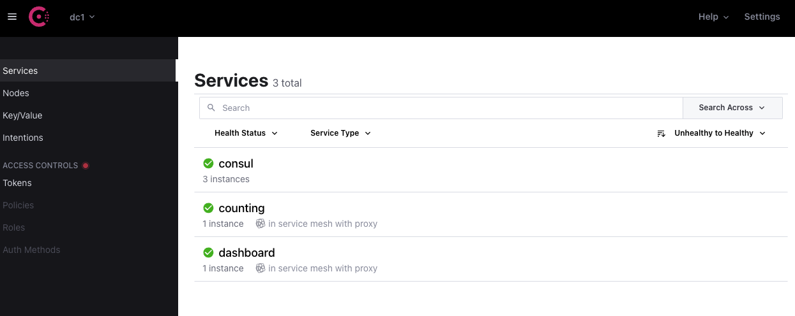
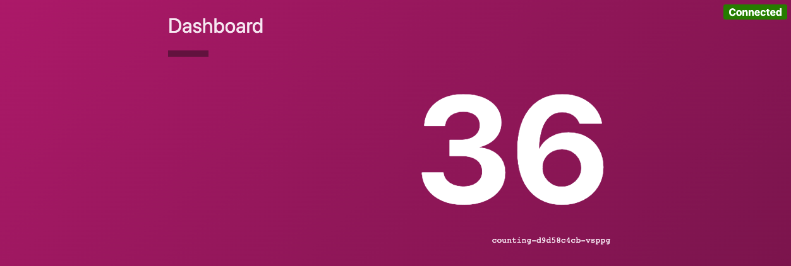
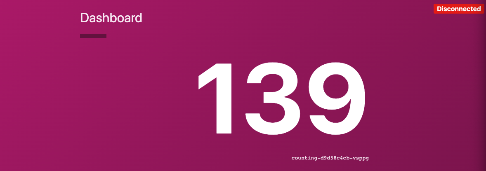
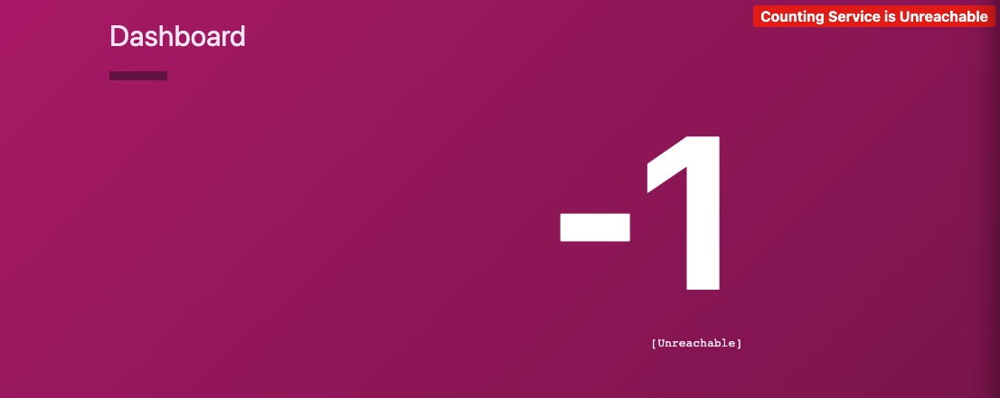

# Consul Service Mesh with AKS and Calico Network Policy

## Prerequisites

1. This repo uses Terraform to install an AKS cluster, you will need the [Terraform CLI](https://learn.hashicorp.com/tutorials/terraform/install-cli) installed.
2. Have a valid Azure subscription and be authenticated in your terminal, however you like to do that.
3. Create a file called `terraform.tfvars` under the terraform directory and add a variable called `subscription_id`. 
   The value of the variable would be your Azure subscription ID.

```hcl
subscription_id        = "<YOUR SUBSCRIPTION ID>"
```

4. Modify `variables.tf` under the terraform directory. Update the value of the `prefix`, `ssh_public_key`, `location`, 
   and `log_analytics_workspace_location` variables to fit your own environment. Copy your SSH public key under 
   the terraform directory.  

## Install AKS and Consul

1. Run `make aks` to build the resource group, AKS cluster and its node pools, etc. Terraform will prompt you asking whether
   to proceed with the deployment, enter `yes` to proceed.
2. Run `make test` to validate your Kubernetes connection to the new cluster via the newly created `azurek8s.kubeconfig`.
3. Run `make consul` to install Consul via Helm. Edit the Helm values file `config.yaml` as desired ahead of the installation.
4. Test your Consul installation by running:

```shell
 > kubectl --kubeconfig terraform/azurek8s.kubeconfig port-forward service/consul-server --namespace consul 8500:8500 &
 > open http://localhost:8500
```



5. Run `make consul-test` to validate your Consul installation. There should be 3 server nodes installed.

```shell
kubectl --kubeconfig terraform/azurek8s.kubeconfig get pod -n consul -l app=consul -l component=server; echo
NAME              READY   STATUS    RESTARTS   AGE
consul-server-0   1/1     Running   0          44s
consul-server-1   1/1     Running   0          44s
consul-server-2   1/1     Running   0          44s

kubectl --kubeconfig terraform/azurek8s.kubeconfig get pod -n consul -l app=consul -l component=server -o custom-columns='NAME:metadata.name,STATUS:status.phase,NODE:spec.nodeName,NODESELECTOR VALUE:spec.nodeSelector.aksVersion'; echo
NAME              STATUS    NODE                                NODESELECTOR VALUE
consul-server-0   Running   aks-firstpool-12253925-vmss000001   <none>
consul-server-1   Running   aks-firstpool-12253925-vmss000000   <none>
consul-server-2   Running   aks-firstpool-12253925-vmss000002   <none>

kubectl --kubeconfig terraform/azurek8s.kubeconfig exec --stdin --tty consul-server-1 --namespace consul -- consul operator raft list-peers; echo
Node             ID                                    Address         State     Voter  RaftProtocol
consul-server-0  94ff21f7-553b-e3c9-b777-fdefd8894a03  10.1.0.37:8300  follower  true   3
consul-server-1  6a146c6a-e9ec-5229-5203-a40833579716  10.1.0.23:8300  leader    true   3
consul-server-2  6ca4612e-f3fe-1979-15d6-65bd5afe2bab  10.1.0.75:8300  follower  true   3
```

You can also run `make all` or simply `make` to execute all 4 steps above.

## Deploy Services

You will now deploy a two-tier application made of a backend data service that returns a number (the counting service), 
and a frontend dashboard that pulls from the counting service over HTTP and displays the number. 

1. Run `make services-install`
2. Check that the dashboard service can connect to the counting service by running:

```shell
> kubectl --kubeconfig terraform/azurek8s.kubeconfig port-forward service/dashboard 9002:9002 &
> open http://localhost:9002
```

You should see the dashboard with an incrementing counter



## Apply Calico Network Policy

Now that the services are up, we can test Calico network policy by applying a policy to deny all traffic within the cluster.

1. Run `make netpol-install`
2. You should see that the dashboard is now showing a `disconnected` status.



3. Run `make netpol-clean` to remove the deny all network policy, your dashboard should return to `connected` status (You
   will need to re-run the port-foward command to the dashboard service to refresh the connection to the pod) 

## Apply Consul Service Mesh Intentions

Consul intentions provide you the ability to control which services are allowed to communicate. 
Next, you will use intentions to test the communication between the dashboard and counting services.

1. Run `make intentions-install`
2. You should see that the dashboard is now reporting counting service as `unreachable`



3. Run `make intentions-clean` to remove the intention, the dashboard should return to `connected` status.

## Clean up
1. Run `make clean`, which calls `terraform destroy` to tear down the AKS cluster.

## Resource

- [Kubernetes cluster with AKS](https://docs.microsoft.com/en-us/azure/developer/terraform/create-k8s-cluster-with-tf-and-aks)
- [AKS Consul Playground](https://github.com/justinclayton/aks-consul-playground)
- [User Terraform to Create and Manage AKS](https://codersociety.com/blog/articles/terraform-azure-kubernetes)
- [Calico Network Policies with AKS](https://cloudblogs.microsoft.com/opensource/2019/10/17/tutorial-calico-network-policies-with-azure-kubernetes-service/)